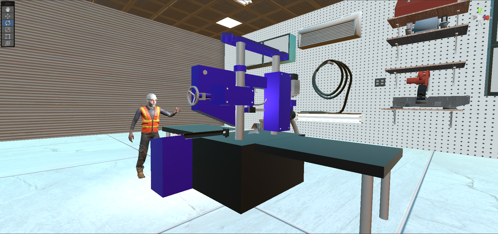

# VR SAFETY TRAINING FOR CUTTING MACHINE 

A basic safety training program for a metal cutting machine in a VR Environment. Used photogrammetry technology to scan the physical machine using an android App Polycam. Designed a 3D model in Blender using the scanned reference modal. Made a realistic environment with a working machine using Unity. 

## How to run

- Download the project from here - https://nextcloud.th-deg.de/s/G9HGpbrHScWnKDD
- Extract the file 
- Open this project in the unity
- Run in play mode

## Software used

- Unity
- Blender
- Polycam

##  Features

- 3D Machine model with functional parts triggered using VR interactive switches.
- Moving machine parts with spatial sound experience
- NPC trainer 
    - AI navigation that follows the user
    - Interactive dialogue system with gestures animation
    
- Aesthetic environment with beautiful terrain and lightings
- Interactive materials that can be worked on machine, for instance metal rods
- Intro cutscene with overview of the terrain using timeline function. 

## Pictures 

